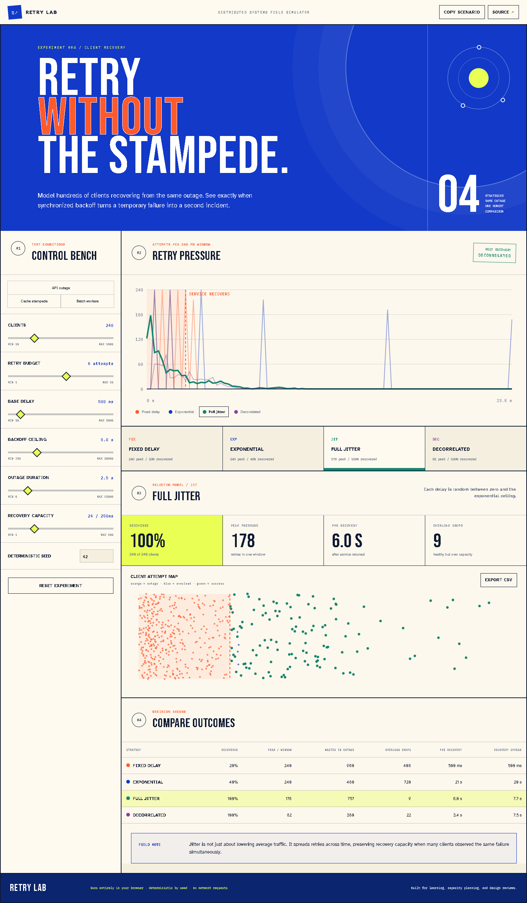

# Retry Lab

[](https://github.com/kyan9400/retry-lab/actions/workflows/ci.yml)
[](https://github.com/kyan9400/retry-lab/actions/workflows/deploy-pages.yml)
[](https://github.com/kyan9400/retry-lab/releases)
[](LICENSE)

An interactive, deterministic simulator for comparing retry and jitter strategies under a shared outage and constrained recovery capacity.

**[Run the live experiment](https://kyan9400.github.io/retry-lab/)**



## What it answers

When hundreds of clients observe the same failure, retry timing can determine whether a recovering service stabilizes or gets overloaded again. Retry Lab makes that behavior visible:

- compare fixed delay, exponential backoff, full jitter, and decorrelated jitter;
- change client count, retry budget, delay, ceiling, outage duration, and recovery capacity;
- inspect retry pressure in 250 ms windows and individual client attempts;
- measure recovery rate, peak load, outage waste, overload drops, P95 recovery, and recovery spread;
- reproduce any run with a deterministic seed;
- share scenarios in a URL and export selected attempt data as CSV.

Everything runs in the browser. There is no backend, analytics, or network data source.

## Simulation model

Each client makes an initial request at time zero, observes the same outage, and schedules up to the configured retry budget. Scheduled attempts are processed chronologically. Before the outage ends they fail; after recovery, only the configured number of requests per 250 ms window can succeed. Excess requests are marked as overload failures and continue to their next scheduled attempt.

The four schedules are:

| Strategy | Delay rule |
|---|---|
| Fixed delay | Always use the base delay |
| Exponential | `min(maxDelay, baseDelay × 2^(attempt−1))` |
| Full jitter | Random value from zero to the exponential ceiling |
| Decorrelated | Random value from the base delay to three times the previous delay, capped |

The simulator is an educational capacity-planning model, not a queueing-theory proof or a replacement for load testing. It deliberately keeps request latency, network partitions, and adaptive server behavior out of scope so retry synchronization remains easy to inspect.

## Why the implementation is deterministic

A small seeded PRNG gives each client a repeatable retry schedule. The same configuration and seed always produce the same result, making scenario links useful in architecture reviews and tests. Imported URL values and saved browser state are normalized into bounded ranges before simulation.

## Development

Requires Node.js 24+ and pnpm 11+.

```bash
corepack enable
pnpm install
pnpm dev
```

Run all checks:

```bash
pnpm lint
pnpm test
pnpm build
```

The suite covers determinism, capacity enforcement, collision behavior, bounded configuration, versioned persistence, strategy selection, scenario sharing, and controls. GitHub Actions repeats lint, tests, and the production build on every pull request and deploys `main` to GitHub Pages.

Version tags run the complete quality suite and publish immutable source and production-site archives. The Pages workflow also verifies the repository asset prefix before deployment.

## Architecture

Simulation rules are pure TypeScript functions under `src/lib`. React owns only configuration and selection state, derives metrics during render, and defers expensive runs while sliders move. Charts are dependency-free SVG components, keeping the runtime bundle small and the output accessible.

## License

[MIT](LICENSE) © Hassan Ak
